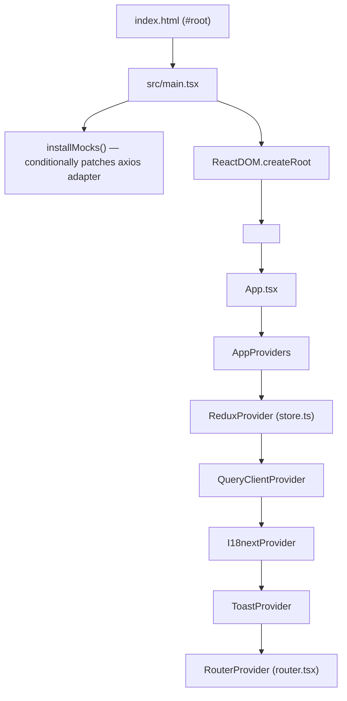
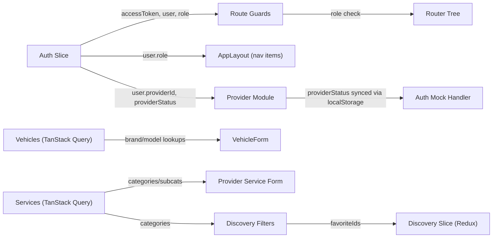

# مقود (Maqwad) Frontend — Technical Audit Report

**Audit Date:** 2026-06-03  
**Auditor:** Senior Software Architect (Automated)  
**Codebase Location:** `d:\maqwad-frontend-project`  
**Methodology:** Static code analysis, dependency review, architectural inspection

---

## 1. PROJECT IDENTITY

| Attribute | Details |
|---|---|
| **Project Name** | `maqwad-frontend` |
| **Purpose** | Web frontend for **مقود (Maqwad)** — a Saudi-market car services marketplace connecting vehicle owners with service providers (workshops, garages, washing, towing, etc.) |
| **Core Problem** | Provides a unified digital platform for car owners to manage vehicles, find nearby service providers, compare prices, and (in future sprints) book services. Also provides an admin review panel and a provider self-registration portal. |
| **Target Users** | Three distinct personas: **Customers** (vehicle owners in Saudi Arabia), **Service Providers** (workshops/garages), and **Admins** (platform operators who review/approve providers). |
| **Maturity Level** | **MVP / Early-stage** — Sprint 0–4 are implemented. The backend is not yet wired (`VITE_USE_MOCKS=true`); all API calls hit an in-process mock adapter. The project is structurally complete but pre-production. |

---

## 2. TECH STACK & ARCHITECTURE

### 2.1 Technology Stack

| Layer | Technology | Version |
|---|---|---|
| **Language** | TypeScript | ~6.0.2 |
| **Framework** | React | ^19.2.6 |
| **Build Tool** | Vite | ^8.0.12 |
| **Routing** | React Router DOM | ^7.15.1 |
| **Global State** | Redux Toolkit + react-redux | ^2.12.0 / ^9.3.0 |
| **Server State** | TanStack React Query | ^5.100.11 |
| **HTTP Client** | Axios | ^1.16.1 |
| **Styling** | Tailwind CSS v4 + CSS variables | ^4.3.0 |
| **UI Primitives** | Radix UI (Dialog, Toast, Avatar, Dropdown Menu, Label, Slot) | Latest |
| **Component Variants** | Class Variance Authority (CVA) + `clsx` + `tailwind-merge` | ^0.7.1 / ^2.1.1 / ^3.6.0 |
| **Forms** | React Hook Form + Zod | ^7.76.0 / ^4.4.3 |
| **i18n** | i18next + react-i18next | ^26.2.0 / ^17.0.8 |
| **Maps** | Leaflet + react-leaflet | ^1.9.4 / ^5.0.0 |
| **Icons** | Lucide React | ^1.16.0 |
| **Linting** | ESLint 10 + typescript-eslint + react-hooks + react-refresh | ^10.3.0 |
| **Formatting** | Prettier + prettier-plugin-tailwindcss | ^3.8.3 / ^0.8.0 |
| **Vite Plugin** | @vitejs/plugin-react + @tailwindcss/vite | ^6.0.1 / ^4.3.0 |

### 2.2 Architecture Pattern

**Modular Feature Architecture** — each domain concern is isolated in `src/modules/<feature>/` with its own `api/`, `components/`, `hooks/`, `pages/`, `schemas/`, `store/`, and `types.ts`. Cross-cutting concerns live in `src/shared/`.

This is a **client-side SPA monolith** — no SSR, no backend-for-frontend. The app communicates with a planned .NET REST API backend via Axios.

**State management is split cleanly:**
- **UI/session state** → Redux Toolkit (auth tokens, filter preferences, multi-step form drafts)
- **Server state** → TanStack React Query (vehicle lists, provider profiles, categories, search results)

### 2.3 Folder Structure Overview

```
d:\maqwad-frontend-project/
├── index.html                  # SPA entry (RTL-first, lang="ar")
├── vite.config.ts              # Build config, path aliases, server port
├── package.json                # Deps + scripts
├── tsconfig*.json              # 3-file TS config (root + app + node)
├── components.json             # shadcn/ui alias config
├── .env / .env.example         # Runtime config (API URL + mocks toggle)
├── eslint.config.js            # ESLint flat config
├── .prettierrc.json            # Formatting rules
├── public/                     # Static assets (favicon)
└── src/
    ├── main.tsx                # Bootstrap: mock install, ReactDOM.createRoot
    ├── App.tsx                 # Root: AppProviders → RouterProvider
    ├── index.css               # Tailwind import
    ├── app/                    # Application-level bootstrapping
    │   ├── i18n.ts             # ~844 lines — ar/en translation resources + sync
    │   ├── providers.tsx       # Provider composition root (Redux, QueryClient, i18n, Toast)
    │   ├── router.tsx          # Full route tree (guest, protected, role-guarded)
    │   └── store.ts            # Redux store + pre-typed hooks
    ├── modules/                # Feature-sliced modules (6 total)
    │   ├── auth/               # Sprint 1 — phone auth, OTP, profile completion
    │   ├── vehicles/           # Sprint 2 — CRUD vehicles, maintenance, upcoming services
    │   ├── services/           # Sprint 2 — read-only service categories catalog
    │   ├── providers/          # Sprint 3 — provider registration, service management
    │   ├── admin/              # Sprint 3 — admin provider review/approval
    │   └── discovery/          # Sprint 4 — nearby search, map, reviews, favorites
    ├── shared/                 # Cross-module shared code
    │   ├── components/         # UI primitives, layout shells, feedback states
    │   ├── guards/             # ProtectedRoute, GuestRoute, RoleGuard
    │   ├── hooks/              # (empty — shared hooks not yet needed)
    │   ├── lib/                # axios.ts, queryClient.ts, storage.ts, utils.ts
    │   ├── mocks/              # In-process mock API layer (4 handler files)
    │   └── types/              # AppError, ApiResponse, Paginated
    ├── styles/
    │   └── globals.css         # Design system tokens (@theme block)
    └── assets/                 # hero.png, vite.svg
```

### 2.4 Entry Points & Bootstrapping Flow



The bootstrap order is deliberate: Redux first (so auth state is available to guards), then TanStack Query, then i18n (for toast translations), then Toast (consumes i18n). The mock installer runs **before** React renders to patch the Axios adapter synchronously.

---

## 3. CORE FEATURES & MODULES

### 3.1 Module Inventory

| Module | Sprint | Files | Purpose |
|---|---|---|---|
| [auth](file:///d:/maqwad-frontend-project/src/modules/auth) | 1 | 10 | Phone login, OTP verification, profile completion, profile editing, avatar upload |
| [vehicles](file:///d:/maqwad-frontend-project/src/modules/vehicles) | 2 | 15 | CRUD vehicles, brand/model/year lookup, maintenance history table, upcoming services |
| [services](file:///d:/maqwad-frontend-project/src/modules/services) | 2 | 4 | Read-only service categories catalog with subcategories and average pricing |
| [providers](file:///d:/maqwad-frontend-project/src/modules/providers) | 3 | 17 | Multi-step provider registration (5 steps), provider service CRUD, KYC document upload |
| [admin](file:///d:/maqwad-frontend-project/src/modules/admin) | 3 | 6 | Provider application review, approve/reject workflow, status filtering |
| [discovery](file:///d:/maqwad-frontend-project/src/modules/discovery) | 4 | 16 | Nearby provider search, map view (Leaflet), filters panel, provider public profile with tabs (services/reviews/info), favorites |

### 3.2 Feature Details

#### Auth Module
- **Pages:** [LoginPage](file:///d:/maqwad-frontend-project/src/modules/auth/pages/LoginPage.tsx), [OtpPage](file:///d:/maqwad-frontend-project/src/modules/auth/pages/OtpPage.tsx), [CompleteProfilePage](file:///d:/maqwad-frontend-project/src/modules/auth/pages/CompleteProfilePage.tsx), [ProfilePage](file:///d:/maqwad-frontend-project/src/modules/auth/pages/ProfilePage.tsx), [DashboardPlaceholderPage](file:///d:/maqwad-frontend-project/src/modules/auth/pages/DashboardPlaceholderPage.tsx)
- **Custom Components:** [OtpInput](file:///d:/maqwad-frontend-project/src/modules/auth/components/OtpInput.tsx) — 6-digit auto-advance input with auto-submit on completion
- **Hooks:** [useAuthMutations](file:///d:/maqwad-frontend-project/src/modules/auth/hooks/useAuthMutations.ts) (register, verifyOTP, updateProfile), [useResendTimer](file:///d:/maqwad-frontend-project/src/modules/auth/hooks/useResendTimer.ts)
- **Validation:** [auth.schemas.ts](file:///d:/maqwad-frontend-project/src/modules/auth/schemas/auth.schemas.ts) — Saudi mobile regex (`/^5\d{8}$/`), 6-digit OTP, profile form with email validation

#### Vehicles Module
- **Pages:** List, Add, Edit, Details (with maintenance history tab and upcoming services)
- **Components:** [VehicleCard](file:///d:/maqwad-frontend-project/src/modules/vehicles/components/VehicleCard.tsx), [VehicleForm](file:///d:/maqwad-frontend-project/src/modules/vehicles/components/VehicleForm.tsx), [BrandModelYearSelect](file:///d:/maqwad-frontend-project/src/modules/vehicles/components/BrandModelYearSelect.tsx), [MaintenanceHistoryTable](file:///d:/maqwad-frontend-project/src/modules/vehicles/components/MaintenanceHistoryTable.tsx), [UpcomingServicesList](file:///d:/maqwad-frontend-project/src/modules/vehicles/components/UpcomingServicesList.tsx), [DeleteVehicleDialog](file:///d:/maqwad-frontend-project/src/modules/vehicles/components/DeleteVehicleDialog.tsx), [AddMaintenanceModal](file:///d:/maqwad-frontend-project/src/modules/vehicles/components/AddMaintenanceModal.tsx)
- **API:** Full CRUD + cascading lookups (brands → models → years) + maintenance + upcoming

#### Providers Module
- **Multi-Step Registration:** 5-step stepper (Company → Location → Services → Documents → Review). Draft data is persisted in Redux slice across step navigations.
- **Components:** [ProviderRegisterStepper](file:///d:/maqwad-frontend-project/src/modules/providers/components/ProviderRegisterStepper.tsx), [RegisterStepCompany](file:///d:/maqwad-frontend-project/src/modules/providers/components/RegisterStepCompany.tsx), [RegisterStepLocation](file:///d:/maqwad-frontend-project/src/modules/providers/components/RegisterStepLocation.tsx), [RegisterStepServices](file:///d:/maqwad-frontend-project/src/modules/providers/components/RegisterStepServices.tsx), [RegisterStepDocuments](file:///d:/maqwad-frontend-project/src/modules/providers/components/RegisterStepDocuments.tsx), [RegisterStepReview](file:///d:/maqwad-frontend-project/src/modules/providers/components/RegisterStepReview.tsx)
- **Provider Service CRUD:** Full service management with category/subcategory linkage, pricing, duration

#### Discovery Module
- **Search:** Nearby providers with geolocation, Leaflet map view, advanced filters (category, radius, min rating, price band, open now)
- **Provider Profile:** Tabbed view (Services, Reviews, Info) on [ProviderPublicDetailsPage](file:///d:/maqwad-frontend-project/src/modules/discovery/pages/ProviderPublicDetailsPage.tsx) (10.8 KB — largest page component)
- **Favorites:** Add/remove favorites with optimistic UI updates via [FavoriteButton](file:///d:/maqwad-frontend-project/src/modules/discovery/components/FavoriteButton.tsx)

### 3.3 Data Flow Between Modules



### 3.4 External APIs & Services

| Service | Status | Notes |
|---|---|---|
| **.NET REST API** | **Not connected** — fully mocked | Planned endpoints for auth, vehicles, lookups, providers, admin |
| **Google Fonts** | Connected (CDN) | IBM Plex Sans Arabic + Tajawal fonts loaded via CSS import in [globals.css](file:///d:/maqwad-frontend-project/src/styles/globals.css#L1) |
| **Leaflet / OpenStreetMap** | Connected (CDN tiles) | Used in discovery map view via react-leaflet |
| **Browser Geolocation API** | Used | For nearby search origin location, with Riyadh fallback |

---

## 4. DATA LAYER

### 4.1 Database / Persistence

This is a **frontend-only project** — there is no database. Data persistence is handled through:

1. **localStorage** — Authentication tokens, user object, language preference, and mock databases. All keys are namespaced under `maqwad.*` prefix (defined in [storage.ts](file:///d:/maqwad-frontend-project/src/shared/lib/storage.ts#L9-L14)).
2. **In-memory mock databases** — Mock handlers store state in `localStorage` under keys like `maqwad.mockDb`, `maqwad.mockVehiclesDb`, `maqwad.mockProvidersDb`, `maqwad.mockDiscoveryDb`.

### 4.2 Data Models (TypeScript Types as Schema)

| Entity | File | Key Fields |
|---|---|---|
| `User` | [auth/types.ts](file:///d:/maqwad-frontend-project/src/modules/auth/types.ts#L15-L28) | id, phoneNumber, fullName, email, role, avatarUrl, isProfileComplete, providerId, providerStatus |
| `Vehicle` | [vehicles/types.ts](file:///d:/maqwad-frontend-project/src/modules/vehicles/types.ts#L33-L49) | id, brandId/Name, modelId/Name, year, plateNumber, color, mileage, vin, fuelType, imageUrl |
| `MaintenanceRecord` | [vehicles/types.ts](file:///d:/maqwad-frontend-project/src/modules/vehicles/types.ts#L67-L76) | id, vehicleId, serviceName, providerName, date, mileage, cost |
| `UpcomingService` | [vehicles/types.ts](file:///d:/maqwad-frontend-project/src/modules/vehicles/types.ts#L87-L96) | id, vehicleId, serviceName, dueDate, dueMileage, urgency |
| `ProviderProfile` | [providers/types.ts](file:///d:/maqwad-frontend-project/src/modules/providers/types.ts#L31-L52) | id, userId, companyName, email, phone, lat/lng, rating, isVerified, status, categoryIds, documents |
| `ProviderService` | [providers/types.ts](file:///d:/maqwad-frontend-project/src/modules/providers/types.ts#L75-L87) | id, providerId, name, price, estimatedDuration, categoryId, subcategoryId |
| `NearbyProvider` | [discovery/types.ts](file:///d:/maqwad-frontend-project/src/modules/discovery/types.ts#L23-L41) | id, companyName, lat/lng, rating, distanceKm, priceFrom, isOpenNow, categoryIds |
| `ProviderReview` | [discovery/types.ts](file:///d:/maqwad-frontend-project/src/modules/discovery/types.ts#L65-L72) | id, providerId, authorName, rating, comment |
| `ServiceCategory` / `ServiceSubcategory` | [services/types.ts](file:///d:/maqwad-frontend-project/src/modules/services/types.ts) | id, nameAr, nameEn, iconUrl, colorHint / averagePrice |

### 4.3 Data Relationships

- `User` → `ProviderProfile` (via `providerId`, one-to-one for provider role)
- `Vehicle` → `Brand` + `VehicleModel` (via `brandId`, `modelId`)
- `Vehicle` → `MaintenanceRecord[]` (one-to-many)
- `Vehicle` → `UpcomingService[]` (one-to-many)
- `ProviderProfile` → `ProviderService[]` (one-to-many)
- `ProviderProfile` → `ProviderDocument[]` (one-to-many KYC docs)
- `ServiceCategory` → `ServiceSubcategory[]` (one-to-many)
- `ProviderService` → `ServiceCategory` + `ServiceSubcategory` (many-to-one)

### 4.4 Migration Strategy

Not applicable — no database. The backend team is expected to own database schema and migrations. The frontend types mirror the planned .NET Swagger contract.

---

## 5. CODE QUALITY ASSESSMENT

### 5.1 Code Organization & Naming Conventions

**Rating: ✅ Excellent**

- **Consistent modular structure:** Every module follows the exact same directory pattern (`api/`, `components/`, `hooks/`, `pages/`, `schemas/`, `store/`, `types.ts`). This is documented in the README and enforced by convention.
- **Naming conventions:** PascalCase for components (`VehicleCard.tsx`), camelCase for hooks (`useAuthMutations.ts`), dot-notation for schemas (`auth.schemas.ts`), Slice suffix for Redux (`authSlice.ts`), Api suffix for transport (`vehiclesApi.ts`).
- **Path aliases:** Well-configured `@app/`, `@modules/`, `@shared/`, `@styles/` with identical mappings in both [vite.config.ts](file:///d:/maqwad-frontend-project/vite.config.ts#L8-L15) and [tsconfig.json](file:///d:/maqwad-frontend-project/tsconfig.json#L7-L14).
- **Separation of concerns:** API transport functions are pure data-in/data-out. Hooks bridge TanStack Query / Redux. Pages compose hooks + components. Components are presentational.

### 5.2 Test Coverage

**Rating: ❌ Zero test files**

- **0 test files** out of 121 source files. No `.test.ts`, `.spec.ts`, or equivalent.
- **No test framework** is installed — no Vitest, Jest, React Testing Library, Playwright, or Cypress in dependencies.
- A manual [TEST_PLAN.md](file:///d:/maqwad-frontend-project/TEST_PLAN.md) exists with 6 adversarial browser-based tests (T1–T6), but these are designed for manual/recorded execution, not automated.
- The TEST_PLAN covers only Sprint 1 auth flows; Sprints 2–4 features have no documented test plan.

> [!CAUTION]
> **Critical Gap:** No automated test infrastructure exists. This is the single most important gap for any team looking to iterate on this codebase.

### 5.3 Error Handling Patterns

**Rating: ✅ Good — Well-structured**

- **Normalised error class:** All API errors are converted to [AppError](file:///d:/maqwad-frontend-project/src/shared/types/api.ts#L32-L44) via the `normaliseError()` function in [axios.ts L114-L126](file:///d:/maqwad-frontend-project/src/shared/lib/axios.ts#L114-L126). This gives every catch block a predictable `{ message, code, status, fields }` shape.
- **Toast notifications:** Success and error toasts are used consistently across mutations.
- **Feedback components:** Three dedicated components — [LoadingState](file:///d:/maqwad-frontend-project/src/shared/components/feedback/LoadingState.tsx), [ErrorState](file:///d:/maqwad-frontend-project/src/shared/components/feedback/ErrorState.tsx) (with retry), [EmptyState](file:///d:/maqwad-frontend-project/src/shared/components/feedback/EmptyState.tsx).
- **Form validation:** Zod schemas provide typed validation with i18n error message keys.
- **Silent catch on logout:** [AppLayout.tsx L50-L52](file:///d:/maqwad-frontend-project/src/shared/components/layout/AppLayout.tsx#L50-L52) — `try { await authApi.logout() } catch {}` — the server logout is best-effort; local state is always cleared.

### 5.4 Code Duplication & Anti-patterns

**Minor issues spotted:**

1. **i18n in a single 844-line file:** [i18n.ts](file:///d:/maqwad-frontend-project/src/app/i18n.ts) contains both Arabic and English translations inline. This is manageable now but will not scale past ~10 modules. Industry convention is to split into `locales/ar/*.json` and `locales/en/*.json`.

2. **Hardcoded Arabic in JSX:** [AuthLayout.tsx L47-L49](file:///d:/maqwad-frontend-project/src/shared/components/layout/AuthLayout.tsx#L47-L49) has three `<Bullet>` items with hardcoded Arabic strings, not passing through `t()`. This will cause them to appear in Arabic even when the language is switched to English.

3. **Hardcoded hint on LoginPage:** [LoginPage.tsx L96-L97](file:///d:/maqwad-frontend-project/src/modules/auth/pages/LoginPage.tsx#L96-L97) — `رمز المثال: 123456` is hardcoded in Arabic, not using i18n. This is test-helper text but should still be controlled or removed.

4. **`storage.get<T>` generic is unchecked:** [storage.ts L23-L31](file:///d:/maqwad-frontend-project/src/shared/lib/storage.ts#L23-L31) casts `JSON.parse(raw) as T` without runtime validation. If `localStorage` is manually corrupted, the app could have runtime type mismatches. A Zod `.safeParse()` would be safer.

### 5.5 Documentation Quality

**Rating: ✅ Good**

- **README:** [README.md](file:///d:/maqwad-frontend-project/README.md) is comprehensive (134 lines, Arabic+English) with tech stack table, folder structure, auth flow diagram, mock API instructions, and DoD checklist.
- **Inline docstrings:** Nearly every function, component, slice, and type has JSDoc-style comments explaining its purpose, why it exists, and what it interfaces with. Examples:
  - [axios.ts L6-L18](file:///d:/maqwad-frontend-project/src/shared/lib/axios.ts#L6-L18) — detailed explanation of request/response interceptor flow
  - [vehiclesSlice.ts L3-L18](file:///d:/maqwad-frontend-project/src/modules/vehicles/store/vehiclesSlice.ts#L3-L18) — rationale for what goes in Redux vs TanStack Query
  - [RoleGuard.tsx L6-L18](file:///d:/maqwad-frontend-project/src/shared/guards/RoleGuard.tsx#L6-L18) — full behavioral specification
- **TEST_PLAN.md:** Manual adversarial test plan with step-by-step instructions and pass criteria.
- **Missing:** No API documentation (Swagger/OpenAPI), no CONTRIBUTING guide, no CHANGELOG.

---

## 6. CONFIGURATION & ENVIRONMENT

### 6.1 Environment Variables

| Variable | Purpose | Default | File |
|---|---|---|---|
| `VITE_API_BASE_URL` | Base URL for all Axios calls | `/api/v1` | [.env](file:///d:/maqwad-frontend-project/.env#L5) |
| `VITE_USE_MOCKS` | Enable/disable in-process mock API adapter | `true` | [.env](file:///d:/maqwad-frontend-project/.env#L9) |

Only **2 environment variables** are used. Both are `VITE_`-prefixed (exposed to the client bundle per Vite convention).

### 6.2 Config Files

| File | Purpose |
|---|---|
| [vite.config.ts](file:///d:/maqwad-frontend-project/vite.config.ts) | Build config: React plugin, Tailwind v4 plugin, path aliases, dev server (port 5173, host: true) |
| [tsconfig.json](file:///d:/maqwad-frontend-project/tsconfig.json) | Root TS config with project references + path aliases |
| [tsconfig.app.json](file:///d:/maqwad-frontend-project/tsconfig.app.json) | App-specific compiler options |
| [tsconfig.node.json](file:///d:/maqwad-frontend-project/tsconfig.node.json) | Node-side TS options (for vite.config.ts) |
| [components.json](file:///d:/maqwad-frontend-project/components.json) | shadcn/ui component aliases (no RSC, CSS variables enabled) |
| [eslint.config.js](file:///d:/maqwad-frontend-project/eslint.config.js) | Flat ESLint config: recommended rules + TS + React hooks + React Refresh |
| [.prettierrc.json](file:///d:/maqwad-frontend-project/.prettierrc.json) | Prettier: semicolons, double quotes, trailing commas, 100 char width, Tailwind plugin |

### 6.3 Per-Environment Configuration

- No multi-environment config (e.g. `.env.production`, `.env.staging`) exists.
- `.env` and `.env.example` are **identical**, both with `VITE_USE_MOCKS=true`.
- There is no build-time environment differentiation beyond the `import.meta.env.DEV` flag used in [store.ts L19](file:///d:/maqwad-frontend-project/src/app/store.ts#L19) for Redux DevTools.

### 6.4 Secrets Management

> [!WARNING]
> The `.env` file is **not in `.gitignore`**. It is currently checked into the repo (360 bytes). While it contains no real secrets today (only a relative path and a boolean), this is a bad practice that should be fixed before any real API keys or backend URLs are added.

- No API keys, JWT secrets, or third-party credentials are present.
- Tokens are stored in `localStorage` (see Security section).

---

## 7. PERFORMANCE & SCALABILITY SIGNALS

### 7.1 Potential Bottlenecks

1. **Single 844-line i18n file:** [i18n.ts](file:///d:/maqwad-frontend-project/src/app/i18n.ts) is loaded eagerly at bootstrap. Both languages (~31 KB) are bundled together. For a production app with more translations, lazy-loading language bundles would be recommended.

2. **No route-level code splitting:** All 25+ page components are imported eagerly in [router.tsx](file:///d:/maqwad-frontend-project/src/app/router.tsx#L1-L25). Every module is loaded on initial page visit even if the user only ever sees the login page. Using `React.lazy()` with `Suspense` would significantly reduce the initial bundle.

3. **Mock handlers size:** The mock handler files total ~70 KB of seed data and logic (`discovery.handlers.ts` alone is 24 KB). While these are tree-shaken in production when `VITE_USE_MOCKS=false`, the conditional check in [server.ts L37](file:///d:/maqwad-frontend-project/src/shared/mocks/server.ts#L37) may not enable dead-code elimination since the imports are top-level in `main.tsx`.

4. **350ms artificial delay on every mock request:** [server.ts L26](file:///d:/maqwad-frontend-project/src/shared/mocks/server.ts#L26) — `await sleep(350)`. Good for dev realism, but ensure it's removed in production.

### 7.2 Caching Strategies

- **TanStack Query:** Properly configured with `staleTime: 60s`, `gcTime: 5min`, `retry: 1`, `refetchOnWindowFocus: false` in [queryClient.ts](file:///d:/maqwad-frontend-project/src/shared/lib/queryClient.ts#L10-L22). This provides automatic HTTP response caching and deduplication.
- **No service worker** or PWA caching.
- **No HTTP cache headers** are configured (frontend-only concern).

### 7.3 Async/Concurrent Patterns

- **Token refresh coordination:** [axios.ts L56-L80](file:///d:/maqwad-frontend-project/src/shared/lib/axios.ts#L56-L80) — Multiple concurrent 401s share a single `refreshInflight` promise. This prevents thundering-herd token refresh attempts. Well-designed.
- **All API calls are async/await** through TanStack Query mutations and queries.
- **Optimistic UI updates:** Favorites toggle uses `addFavoriteLocal` / `removeFavoriteLocal` Redux actions for instant UI response before the server confirms.

---

## 8. SECURITY OBSERVATIONS

### 8.1 Input Validation

**Frontend-side:** ✅ Present and consistent

- Zod schemas validate all form inputs: phone numbers (Saudi regex), OTP codes, vehicle plate numbers, VINs, email addresses, provider registration fields.
- Schema files exist per module: [auth.schemas.ts](file:///d:/maqwad-frontend-project/src/modules/auth/schemas/auth.schemas.ts), [vehicles.schemas.ts](file:///d:/maqwad-frontend-project/src/modules/vehicles/schemas/vehicles.schemas.ts), [providers.schemas.ts](file:///d:/maqwad-frontend-project/src/modules/providers/schemas), [discovery.schemas.ts](file:///d:/maqwad-frontend-project/src/modules/discovery/schemas/discovery.schemas.ts).

**Backend-side:** Not applicable (frontend-only project), but the mock layer also validates inputs (e.g., [auth.handlers.ts L158](file:///d:/maqwad-frontend-project/src/shared/mocks/handlers/auth.handlers.ts#L158) validates phone format).

### 8.2 Authentication / Authorization

- **Token storage:** `localStorage` ([storage.ts](file:///d:/maqwad-frontend-project/src/shared/lib/storage.ts)) — this is standard for SPAs but vulnerable to XSS. HttpOnly cookies would be more secure but require backend cooperation.
- **Auto-refresh:** 401 responses trigger a single token refresh attempt, then redirect to login ([axios.ts L90-L104](file:///d:/maqwad-frontend-project/src/shared/lib/axios.ts#L90-L104)).
- **Route protection:** Three-tier guard system:
  - [GuestRoute](file:///d:/maqwad-frontend-project/src/shared/guards/GuestRoute.tsx) — blocks authed users from login/OTP
  - [ProtectedRoute](file:///d:/maqwad-frontend-project/src/shared/guards/ProtectedRoute.tsx) — blocks unauthed users, enforces profile completion
  - [RoleGuard](file:///d:/maqwad-frontend-project/src/shared/guards/RoleGuard.tsx) — role-based access with redirect to appropriate home page
- **Admin role escalation protection:** The mock handler at [auth.handlers.ts L234-L236](file:///d:/maqwad-frontend-project/src/shared/mocks/handlers/auth.handlers.ts#L234-L236) prevents clients from setting `role: "admin"` via `PUT /users/me`.

### 8.3 Security Concerns

> [!WARNING]
> **Tokens in localStorage:** Access and refresh tokens are stored in `localStorage`, which is accessible to any JavaScript running on the page. An XSS vulnerability would allow token theft. Consider using `httpOnly` cookies when the backend is available.

> [!NOTE]
> **No `dangerouslySetInnerHTML`** found anywhere in the codebase — good.
> **No `eval()` calls** found — good.
> **No hardcoded API keys or secrets** in source code.

- **CSRF:** Not applicable (localStorage tokens, not cookies).
- **Content Security Policy:** Not configured in `index.html`.
- **Subresource Integrity:** Google Fonts CDN link has no SRI hash.
- **Mock tokens are trivially guessable:** `mock.access.${random}` — acceptable for dev, must not ship.

---

## 9. DEPENDENCIES HEALTH

### 9.1 Dependency Count

| Category | Count |
|---|---|
| **Production dependencies** | 22 |
| **Dev dependencies** | 11 |
| **Total** | 33 |

### 9.2 Dependency Assessment

| Package | Version | Status | Notes |
|---|---|---|---|
| `react` / `react-dom` | ^19.2.6 | ✅ Latest | React 19 — cutting edge |
| `typescript` | ~6.0.2 | ✅ Latest | TypeScript 6 — very recent |
| `vite` | ^8.0.12 | ✅ Latest | Vite 8 — latest major |
| `tailwindcss` | ^4.3.0 | ✅ Latest | Tailwind v4 — latest major |
| `@tanstack/react-query` | ^5.100.11 | ✅ Current | |
| `@reduxjs/toolkit` | ^2.12.0 | ✅ Current | |
| `react-router-dom` | ^7.15.1 | ✅ Current | |
| `axios` | ^1.16.1 | ✅ Current | |
| `zod` | ^4.4.3 | ✅ Current | Zod 4 — latest major |
| `i18next` | ^26.2.0 | ✅ Current | |
| `react-hook-form` | ^7.76.0 | ✅ Current | |
| `leaflet` / `react-leaflet` | ^1.9.4 / ^5.0.0 | ✅ Current | |
| `lucide-react` | ^1.16.0 | ✅ Current | |
| `eslint` | ^10.3.0 | ✅ Latest | ESLint 10 — very recent flat config |

**All dependencies appear to be current and actively maintained.** The project uses the latest major versions of all key libraries.

### 9.3 Unused Dependencies

- **`@radix-ui/react-avatar`** — Listed as a dependency but I found no usage in the scanned source files. The avatar display in AppLayout uses a simple div with initial letter, not the Radix Avatar primitive.
- **`@radix-ui/react-dropdown-menu`** — Listed but not observed in imports. May be unused or used in components I didn't fully expand.

### 9.4 Missing Dependencies

- **No test framework** — Vitest or similar is needed for any automated testing.
- **No error boundary library** — `react-error-boundary` or a custom boundary is absent. Runtime errors in any component will crash the entire app.

---

## 10. ISSUES & TECHNICAL DEBT

### 10.1 Critical Issues

| # | Issue | Severity | Location | Details |
|---|---|---|---|---|
| 1 | **No automated tests** | 🔴 Critical | Project-wide | Zero test files. No test framework installed. Manual TEST_PLAN.md covers only Sprint 1. |
| 2 | **No route-level code splitting** | 🟠 High | [router.tsx](file:///d:/maqwad-frontend-project/src/app/router.tsx) L1-25 | All 25+ pages are eagerly imported. Initial bundle will include dead code for unused roles. |
| 3 | **No Error Boundary** | 🟠 High | App.tsx / router.tsx | Any uncaught render error will crash the entire app with a white screen. |
| 4 | **`.env` not in `.gitignore`** | 🟡 Medium | [.gitignore](file:///d:/maqwad-frontend-project/.gitignore) | `.env` with `*.local` is gitignored, but `.env` itself is not. Will leak secrets once real values are added. |
| 5 | **Hardcoded Arabic in AuthLayout** | 🟡 Medium | [AuthLayout.tsx L47-L49](file:///d:/maqwad-frontend-project/src/shared/components/layout/AuthLayout.tsx#L47-L49) | Three bullet points bypass i18n — will show Arabic in English mode. |
| 6 | **Mock adapter not tree-shakeable** | 🟡 Medium | [main.tsx L4](file:///d:/maqwad-frontend-project/src/main.tsx#L4) | `installMocks()` is called unconditionally. While it early-returns when `VITE_USE_MOCKS=false`, the 70 KB of mock handler code is still in the production bundle because imports are top-level. |
| 7 | **localStorage not validated on read** | 🟡 Medium | [storage.ts L23-L31](file:///d:/maqwad-frontend-project/src/shared/lib/storage.ts#L23-L31) | `JSON.parse(raw) as T` — corrupted localStorage can cause runtime type errors. |

### 10.2 TODOs / FIXMEs / HACKs

**None found in the codebase.** A `grep` for `TODO|FIXME|HACK|XXX|TEMP|WORKAROUND` returned zero results in source files. This is either a sign of good discipline or insufficient annotation of known limitations.

### 10.3 Console Statements

Only **2 console statements** found, both in [server.ts](file:///d:/maqwad-frontend-project/src/shared/mocks/server.ts):
- Line 44: `console.warn(...)` — warns when mock adapter fails to install
- Line 53: `console.info(...)` — confirms mock API activation

These are appropriate for the mock layer but should be stripped in production.

### 10.4 Missing Features / Incomplete Implementations

| Feature | Status | Notes |
|---|---|---|
| **Dashboard** | ⚠️ Placeholder | [DashboardPlaceholderPage.tsx](file:///d:/maqwad-frontend-project/src/modules/auth/pages/DashboardPlaceholderPage.tsx) — just a welcome message, no real dashboard content |
| **Order/Booking Flow** | ❌ Not started | Discovery CTA shows "قريبًا" (Coming soon) — [i18n.ts L404](file:///d:/maqwad-frontend-project/src/app/i18n.ts#L404) |
| **Payment** | ❌ Not started | No payment integration or UI |
| **Notifications** | ❌ Not started | No push/in-app notifications system |
| **Real Backend Integration** | ❌ All mocked | `VITE_USE_MOCKS=true` — no real API has been connected |
| **Image Upload (Real)** | ⚠️ Mock only | Avatar and vehicle images use mock URLs like `mock://avatar/{id}` |
| **Map Picker for Provider Location** | ⚠️ Noted as future | [i18n.ts L208](file:///d:/maqwad-frontend-project/src/app/i18n.ts#L208) — "سنضيف اختياراً من الخريطة لاحقاً" (map picker coming later) |
| **404 Page** | ❌ Missing | Catch-all route redirects to `/login` instead of showing a proper 404. [router.tsx L132](file:///d:/maqwad-frontend-project/src/app/router.tsx#L132) |
| **Offline Support** | ❌ None | No service worker, no offline fallback |
| **Pagination** | ⚠️ Types only | `Paginated<T>` type exists in [api.ts L24-L29](file:///d:/maqwad-frontend-project/src/shared/types/api.ts#L24-L29) but no page actually uses pagination — all lists load fully |

### 10.5 Architectural Debt

1. **Dual state management complexity:** Using both Redux Toolkit AND TanStack Query is a valid pattern, but the boundary rules need team training. The codebase handles this well today but there's risk of developers putting server state in Redux or UI state in queries.

2. **i18n resources inline:** Having 800+ lines of translations in a TypeScript file rather than separate JSON resources means:
   - No support for translation tools (Lokalise, Crowdin)
   - No lazy loading per language
   - Merge conflicts when multiple developers add translations simultaneously

3. **Mock adapter coupling:** The mock DB uses `localStorage` and cross-reads between handlers (e.g., auth handler reads `maqwad.mockProvidersDb` at [auth.handlers.ts L125](file:///d:/maqwad-frontend-project/src/shared/mocks/handlers/auth.handlers.ts#L125)). This creates hidden coupling that will need to be completely replaced when connecting to the real backend.

---

## 11. SUMMARY TABLE

| Dimension | Status | Notes |
|---|---|---|
| **Architecture** | ✅ | Clean modular feature architecture with well-defined boundaries. Dual state management (Redux + TanStack Query) is applied correctly. Provider composition is properly ordered. |
| **Code Quality** | ✅ | Excellent naming conventions, consistent patterns, comprehensive docstrings. Minor issues: hardcoded Arabic strings, i18n in a single file, no runtime validation on localStorage reads. |
| **Test Coverage** | ❌ | **Zero automated tests.** No test framework installed. Only a manual test plan for Sprint 1. This is the most critical gap. |
| **Security** | ⚠️ | Auth tokens in localStorage (XSS risk), no CSP, no error boundaries. But: no dangerouslySetInnerHTML, no eval, admin escalation is prevented, route guards are robust. Acceptable for MVP stage. |
| **Documentation** | ✅ | Comprehensive README in Arabic, inline JSDoc on nearly all functions, TEST_PLAN.md for Sprint 1. Missing: CONTRIBUTING, CHANGELOG, API docs. |
| **Performance** | ⚠️ | No code splitting, 844-line i18n eagerly loaded, mock handlers bundled in production. TanStack Query caching is well-configured. Token refresh coordination is solid. |
| **Dependencies** | ✅ | 33 total deps, all current/latest versions. No deprecated packages. Possible unused: `@radix-ui/react-avatar`, `@radix-ui/react-dropdown-menu`. Missing: test framework, error boundary. |
| **Technical Debt** | ⚠️ | No TODO markers but significant structural debt: no tests, no code splitting, no error boundaries, no 404 page, placeholder dashboard, all APIs mocked. Acceptable for MVP sprint stage. |

---

## Overall Assessment

**مقود (Maqwad) is a well-architected MVP frontend** with professional code organization, strong typing, and excellent developer documentation. The modular structure will scale well to additional sprints. The team has made sound library choices and the code quality is above average for a project at this stage.

**Top 5 Priorities for Production Readiness:**

1. **Install Vitest + React Testing Library** and add tests for auth flow, route guards, and core mutations
2. **Add `React.lazy()` code splitting** on all page-level route imports in `router.tsx`
3. **Add a global `ErrorBoundary`** wrapping the router to prevent white-screen crashes
4. **Fix `.gitignore`** to exclude `.env` and add `.env.local` for developer overrides
5. **Make mock imports dynamic** via `import()` gated on `VITE_USE_MOCKS` to prevent bundling 70 KB of mock data in production
